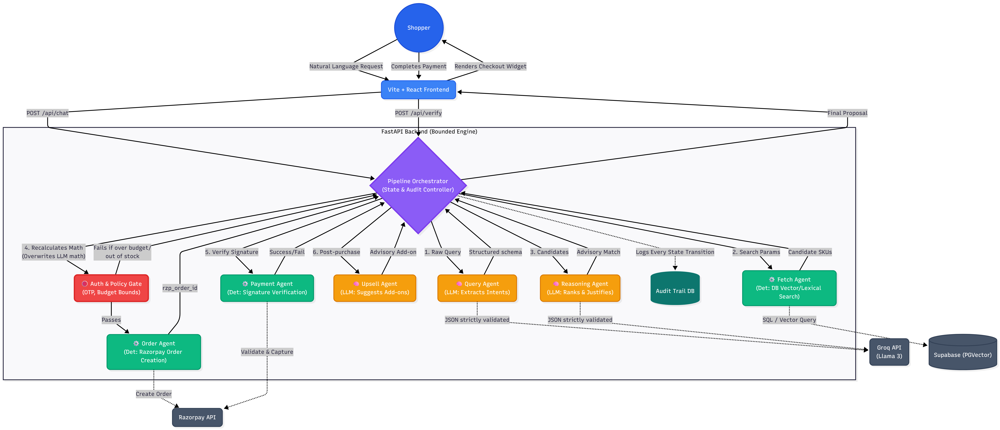

# Agentic Checkout — Razorpay Buildathon (Track 01)

An agentic commerce pipeline that transforms unstructured natural-language requests into precise, verified transactions. It intelligently searches a merchant catalog, reasons about budget and stock, and strictly routes through deterministic policy gates before creating a Razorpay test-mode payment. 

Every action is explainable, bounded, and logged to an immutable audit trail.

**Live Demo:** [https://commerce-agent-brown.vercel.app/](https://commerce-agent-brown.vercel.app/)  
---

## 🏗️ The Bounded Architecture

This architecture was explicitly designed around the Razorpay Buildathon constraints: **"Every money action explainable, bounded and gated."**

We intentionally restricted LLMs to natural language reasoning and search extraction, while keeping all arithmetic, inventory checks, pricing, and checkout state strictly deterministic (in Python).



---

## 🧠 AI Judgment & Graceful Failure

As per the buildathon judging criteria ("the right tool in the right place, and where you chose not to use one"):

1. **Where we used AI:** Intent extraction (`query_agent`), subjective product ranking/matching (`reasoning_agent`), and contextual recommendations (`upsell_agent`).
2. **Where we explicitly BANNED AI:** 
   - **Math & Inventory:** The reasoning agent is allowed to *suggest* a product, but the Orchestrator recalculates the total price and checks stock deterministically. If the LLM hallucinates a price, the system immediately overwrites it with the source-of-truth database price.
   - **Financial execution:** The Order and Payment agents are 100% deterministic Python code. The LLM cannot authorize a payment, it can only build a cart that the deterministic gate approves.
3. **Graceful Failure:** If a user requests an item that is out-of-stock or exceeds their budget, the LLM does not crash or hallucinate. The Orchestrator intercepts it, rejects the decision, and surfaces `RelaxationOptions` (e.g., *"Would you like to drop the brand constraint?"* or *"Reduce quantity?"*).

---

## 🛡️ Guardrails & Safety Boundaries

The system is fortified by strict Pydantic schemas and deterministic overrides at every boundary.

| Boundary | Guardrail Implementation |
|---|---|
| **Query extraction** | `ProductQuery` schema strictly rejects malformed/out-of-range fields. |
| **Catalog → Fetch** | `FetchedProduct` schema on every row; malformed rows are dropped. |
| **Reasoning Agent Output** | `ReasoningDecision` schema enforces enum-constrained decisions. **Deterministic Recompute:** the orchestrator recalculates `price × qty` itself and overrides the LLM's number if it doesn't match. |
| **Reasoning → Gate** | The gate (`gate.py`) contains **zero LLM calls**. Plain Python `if` checks validate budget, stock, and OTP thresholds. |
| **Gate → Order Agent** | Uses a single-use, expiring `gate_token` persisted in Supabase. An order cannot be created without a token, and if an OTP was required, it cannot be consumed until verified. |
| **High-value Orders** | OTP challenges are issued dynamically. The Order Agent is never invoked until the code matches. |
| **Order → Payment** | The Payment Agent looks up the final amount from its own secure order record, never from the client payload. Tampered client-side amounts cannot change what is captured. |
| **Upsell Agent** | Rejects any suggested SKU that wasn't actually in the candidate list offered to it. |
| **Catalog → Prompt** | `sanitize.py` strips instruction-like phrases (prompt-injection defense) before product descriptions ever reach an LLM's context window. |

---

## 🤖 Agent-Readable Catalog (External AI Buyers)

A cold AI buyer agent — one that has never seen this project's UI — can discover and transact with this merchant using zero prior integration:

1. `GET /.well-known/agent-manifest.json` — Returns what's sold here, where the catalog and checkout endpoints live, and the merchant's policy constraints (auto-approve limit, OTP requirement).
2. `GET /api/catalog?category=&max_price=` — The actual product listing, filterable by agents, with no chat pipeline required.

We have included `external_agent_demo/agent_client.py`, which is a standalone script with zero knowledge of the React UI. It calls the plain HTTP API exactly as a third-party shopping assistant would, proving the merchant is fully **transactable end-to-end by an external agent**.

---

## 💻 Local Development Setup

### 1. Setup Supabase
1. Create a project at [supabase.com](https://supabase.com).
2. Open **SQL Editor → New query**, paste the contents of `backend/supabase_schema.sql`, and run it. This creates the tables and seeds the catalog.
3. Go to **Project Settings → API** and copy your **Project URL** and **anon public key**.

### 2. Setup Razorpay (Test Mode)
1. Sign in to the [Razorpay dashboard](https://dashboard.razorpay.com).
2. Ensure **Test Mode** is toggled on.
3. Go to **Settings → API Keys → Generate Test Key** and copy the `Key Id` and `Key Secret`.

### 3. Setup Groq / LLM
Get a free API key from [Groq](https://console.groq.com/). Used by the query, reasoning, and upsell agents for lightning-fast Llama-3 inference.

### 4. Run the Backend
```bash
cd backend
python -m venv venv
source venv/bin/activate    # Windows: venv\Scripts\activate
pip install -r requirements.txt

cp .env.example .env
# Fill in: GROQ_API_KEY, SUPABASE_URL, SUPABASE_KEY, RAZORPAY keys

uvicorn app.main:app --reload --port 8000
```
> *Note: The app falls back to an in-memory catalog if Supabase/Razorpay keys aren't set, so you can sanity-check the server.*

### 5. Run the Frontend
```bash
cd frontend
npm install
cp .env.example .env    # Defaults to http://localhost:8000
npm run dev
```
Visit `http://localhost:5173`.

### 6. Testing the Flows
- **Happy Path:** `3 lavender candles under 1500`. Confirm the order, use test card `4111 1111 1111 1111`, see the receipt, and accept the complementary upsell offer.
- **Graceful Fallback:** Ask for `2 sandalwood candles` (seeded with 0 stock). The agent will seamlessly suggest in-stock alternatives instead of failing.
- **OTP Gate:** Ask for an order exceeding `BUDGET_AUTO_APPROVE_LIMIT` (e.g., `2 wireless earbuds under 3500`). The UI will demand a 6-digit code. Check your backend terminal for the simulated OTP.
